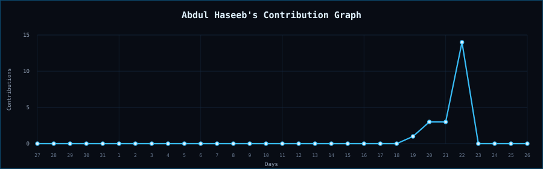

<!-- GitHub Profile README for github.com/Haseeb2172 -->

 

 

<h3 align="center">◉ <i>Technologies</i></h3>

 

Now learning scikit learn, SQL, model evaluation, and feature engineering.

 

<h3 align="center">◉ <i>Statistics</i></h3>

 

<h3 align="center">◉ <i>About Me</i></h3>

<table width="100%">
  <tr>
    <td width="35%" align="center" valign="middle">
      <h3>FROM CURIOSITY TO CODE</h3>
      

        <samp>
          QUESTION → EXPERIMENT 
          RESULT → IMPROVEMENT
        </samp>
      

    </td>
    <td width="65%" valign="middle">
      

        Hi, I am <b>Abdul Haseeb</b>, a BS Artificial Intelligence student
        from Pakistan.
      

      

        I got interested in AI because I wanted to understand what happens
        between a messy dataset and a useful decision. What started as
        curiosity has become a habit of taking ideas out of lectures and
        testing them on real data.
      

      

        Right now, I am turning the fundamentals into visible work. Every
        project here is meant to show what I understood, how I tested it,
        what went wrong, and what I would improve next.
      

      

        I am still at the beginning, and I am comfortable saying that. This
        profile is not a claim that I have arrived. It is a public record of
        me doing the work.
      

    </td>
  </tr>
</table>

 

<h3 align="center">◉ <i>Hobbies &amp; Goals</i></h3>

<table width="100%">
  <tr>
    <td width="68%" valign="middle">
      

        I enjoy exploring new technology, understanding how intelligent
        systems work, solving problems through code, and turning complicated
        ideas into explanations that make sense.
      

      

        By 2027, I want this profile to tell a simple story: I learned the
        foundations, built serious machine learning projects, contributed to
        open source, and became ready to help an international team as a
        remote intern.
      

      <blockquote>
        I am not trying to look finished. I am building the evidence.
      </blockquote>
    </td>
    <td width="32%" align="center" valign="middle">
      <h3>2027</h3>
      

        <samp>
          LEARN 
          BUILD 
          CONTRIBUTE 
          GROW
        </samp>
      

    </td>
  </tr>
</table>

 

<samp>Learn deeply · Build honestly · Improve continuously</samp>

